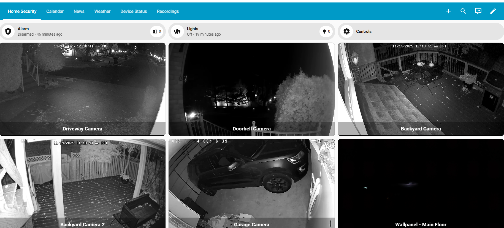

# MediaMTX Integration for Home Assistant

This integration provides a WebRTC Video component for MediaMTX within Home Assistant.

## Features

- A WebRTC video component for Home Assistant and MediaMTX
- Requests are authenticated via Home Assistant before being proxied to your MediaMTX instance.
- Built for "wife friendly" use. Tap to go full screen, tap again to return.
- Ideal for Kiosks. When not full screen, live video will not keep your screen alive, so your Kiosk can sleep properly.
- Support for 'activities' to call attention to people/objects in video
- Support for 'events' which can automatically set video to full screen



## Installation (via HACS)

1. Go to HACS → Integrations → ⋮ → Custom repositories.
2. Add:

https://github.com/JoeHogan/ha-mediamtx

with category **Integration**.
3. Install **MediaMTX Integration**.
4. Restart Home Assistant.
5. Add the integration via *Settings → Devices & Services → Add Integration → MediaMTX*.
6. Input the URL and port of your MediaMTX instance

## Configuration

You’ll be prompted for your MediaMTX service URL (e.g. `http://192.168.1.X:8899`).

## Card Options

### type
    Required: custom:mediamtx-webrtc-card

### resource
    Required: the name of your MediaMTX camera stream

### name
    Optional: the name you want to appear under the video

### activity
    Optional: sensor events used to highlight camera activity

    - entity: the sensor to track
    - state: the state of the sensor used to determine if an activity is happening
    - name: The name of the tag that will appear when the activity is occurring

### event
    Optional: sensor events used to automatically set video to full screen

    - entity: the sensor to track
    - state: the state of the sensor used to determine if an event is happening
    - timeoutSeconds: how long to wait to return the video to normal size, assuming the event is ongoing. This is optional; omitting this keeps the video at full screen until manually closed.

### preview
    Advanced/Optional: Show preview images to reduce memory. See advanced configuration information. 

## Card Usage Examples

### Basic

```
    - type: custom:mediamtx-webrtc-card
      resource: driveway_camera
      name: Driveway Camera
```

### Activity and Events

```
  - type: custom:mediamtx-webrtc-card
    resource: driveway_camera
    name: Driveway Camera
    preview: true
    activity:
        - entity: binary_sensor.driveway_primary_zone_person_occupancy
          state: 'on'
          name: Person
        - entity: binary_sensor.driveway_secondary_zone_car_occupancy
          state: 'on'
          name: Car
    event:
        entity: binary_sensor.driveway_secondary_zone_car_occupancy
        state: 'on'
        timeoutSeconds: 60
```

## Advanced Configuratoin

You can configure MediaMTX to take snapshots of each camera at intervals (ie: every 3 seconds), and this integration can show those snapshots at an interval until you click on the video to go full screen, at which point the WebRTC stream begins. This is useful for displaying many camera streams on a single dashboard where you have memory constraints (ie: Fire Tablet). See the 'examples/image_preview' folder for instructions on how to configure MediaMTX.

The important part is that requests are made to the same url/port as MediaMTX, but include /img/ in the path. You may use Nginx or similar to properly route requests for /img/ to your image folder while all other paths route though to MediaMTX.

Once configured, you may simply add the 'preview' property:

```
  - type: custom:mediamtx-webrtc-card
    resource: driveway_camera
    name: Driveway Camera
    preview: true
```

